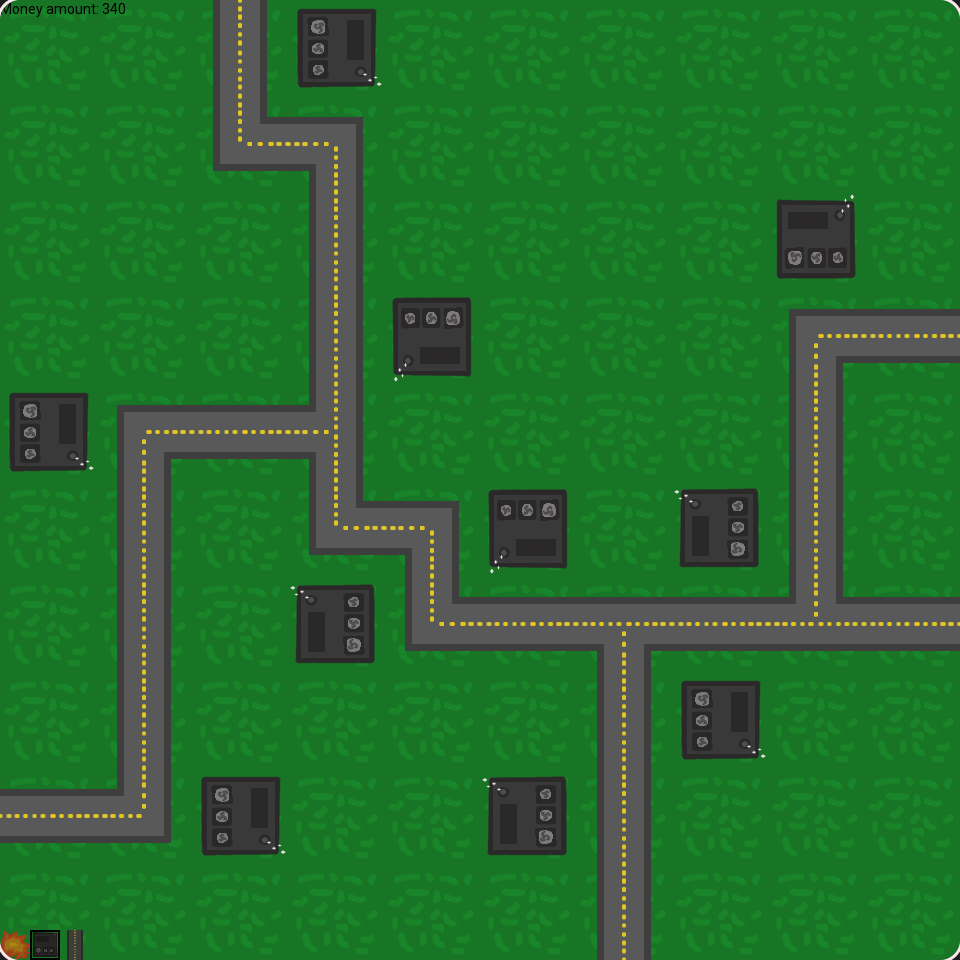

# CityBuilder
sandbox city builder game written in C++ (using SFML)

# How to play:
Enter a build mode and left click on a tile.\
Q: Destruction mode\
W: Build houses\
E: Build roads

(you can also use the buttons in the bottom left corner)

# Screenshot:
<kbd></kbd>